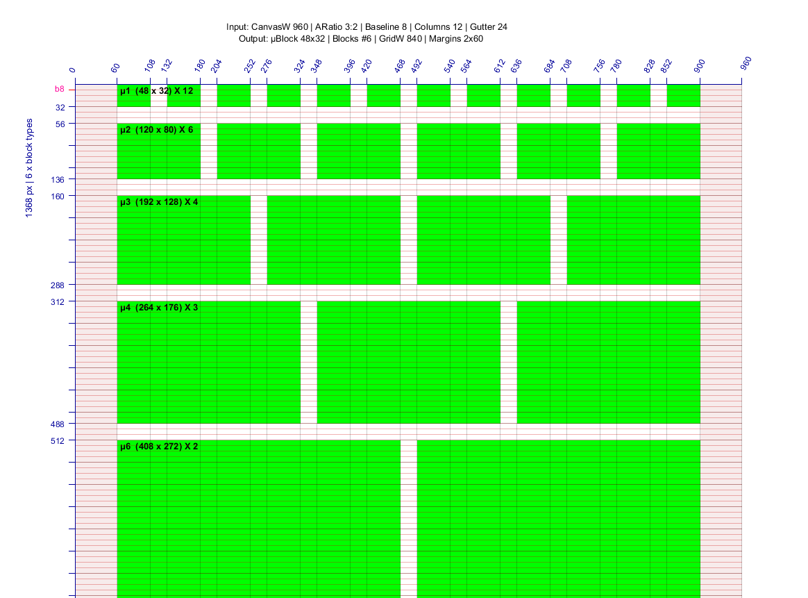

A project exploring font rhythm in design grids. See a demo at [nazikus.github.io/rhythmic-grids][demo]. For details and explanations see [medium article][medium].

[demo]: https://nazikus.github.io/rhythmic-grids
[medium]: https://medium.com/concordia-grid/make-modular-grids-in-seconds-e2eeee95aa4f

Project structure:
- `Matlab/` - Matlab exploratory analysis and implementation of rhythmic grid formula
- `JavaScript/` - ES3 implementation for different JS environments: ES5 browsers (V8, SpiderMonkey, JavaScriptCore), ES3 Photoshop ExtendedScript, ES5 CocoaScript
- `ScriptFu/` - [GIMP](https://www.gimp.org/) automation scripts to generate PhotoShop `.psd` files on the server side.
- `UI/` - single-page app, see at [nazikus.github.io/rhythmic-grids][demo].

Credits:
 - idea and design [@rsokolovski](https://github.com/rsokolovski)
 - algorithm design and exploration [@nazikus](https://github.com/nazikus)
 - frontend [@ArsenBatyuchok](https://github.com/ArsenBatyuchok)

---

# Rhythmic grids generator

A rhythmic grid is a type of grid for layout design where the size of blocks (grid cells) are aligned strictly and with preserved proportions to font baseline and gutter width between the blocks.

The current generator computes optimal rhythmic blocks for a given grid configuration (max. width, aspect ratio, font baseline, columns, gutter). The generator is based on the following modular arithmetics:

**Rhythmic grid example**:
 * Max. canvas width - 960px
 * Aspect ratio - 3x2
 * Baseline - 8px
 * Columns - 12
 * Gutter - 24px
 * blocks - [48x32 120x80 192x128 264x176 408x272] px

For current grid configuration algorithm generates a grid with micro-block of size 48x32px, s.t. the rest blocks are generated and aligned proportionally (including gutter) preserving ratio with baseline.

Matlab code allows to explore a space of possible rhythmic grids within configuration limits:

# Font metrics explorer

In addition, a font metrics explorer tool is available to test your system fonts for compliance with the web 'safebox' convention (500UPM) as a difference from the recommended UPM size.

